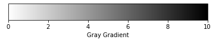
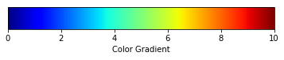

# 图像工程第一次作业 19210-3 霍英涛
## 1-1：读取BMP文件
BMP文件格式：

| 数据段名称 | 大小（Byte） |
-|-
bmp头文件| 14
位图信息头| 40
调色板| 由颜色索引数决定
位图数据 |由图像尺寸决定

> 在BmpRGB.py文件中，通过unpack解析bmp文件，读出bmp文件头，还有r，g，b分量，为下一题准备数据。

## 1-2：将BMP彩图转为灰度图
> 对于（0.25，0.5），我理解为将灰度图中的所有灰度值缩放到（64，127）之间，代码如下
```python
merged = cv2.merge([b,g,r])
gray = np.dot(merged,(0.2989,0.5870,0.114))
max = np.max(gray)
min = np.min(gray)
for i in range(bmpFile.Height):
    for j in range(bmpFile.Width):
        gray[i][j] = (127.0 - 64.0 + 1.0)/(max - min)*(gray[i][j] - min) + 64.0
 ```
### 原图

### 灰度处理后

### （0.25，0.5）处理后


## 2-1：色阶分级统计

### 2-1-1：白黑渐变


测试人员|测试结果
:-:|:-:
测试人员A|[0.5，1.5，3，5，7]
测试人员B|[0.5，1.5，2，4，5，6，9]
测试人员C|[0.5，2，5，7，8]
测试人员D|[1，2，4，7，8]
测试人员E|[1，4，5，7，8]

### 2-1-2：单彩渐变

测试人员|测试结果
:-:|:-:
测试人员A|[2.5，4，7，9]
测试人员B|[0.5，2，2.5，3，4，5，6，7，8，9]
测试人员C|[0.5，2，4，6，8，9]
测试人员D|[0.5，2，3，5，8]
测试人员E|[1，3，5，7，9]

### 2-1-3：七彩渐变

测试人员|测试结果
:-:|:-:
测试人员A|[1.5，3.5，4.5，5.5，6.5，7，7.5，8，9]
测试人员B|[0.5，1，2，3.5，4.5，5.5，6.3，7，7.5，8，9]
测试人员C|[1，2，3，4，5.5，6.5，7.5，9]
测试人员D|[0.5，1，2，3，3.5，4.5，6，6.5，7，8，9]
测试人员E|[1，3，4，5.7，6.4，8，9]

### 2-1-4：统计总结与分析
> 人眼普遍能将白黑渐变划分出五阶，单彩渐变划分出5至6阶，七彩渐变划分出7至8阶。且对于白黑渐变敏感的人眼，对于其他颜色的渐变也较为敏感。

## 附录：代码结构
> 主函数为main.py，通过调用BmpRGB.py中的ReadBMPFile类来解析BMP文件，并返回一个包含此文件所有信息的结构体。作业要求的各项操作均在main.py中以函数的形式出现。